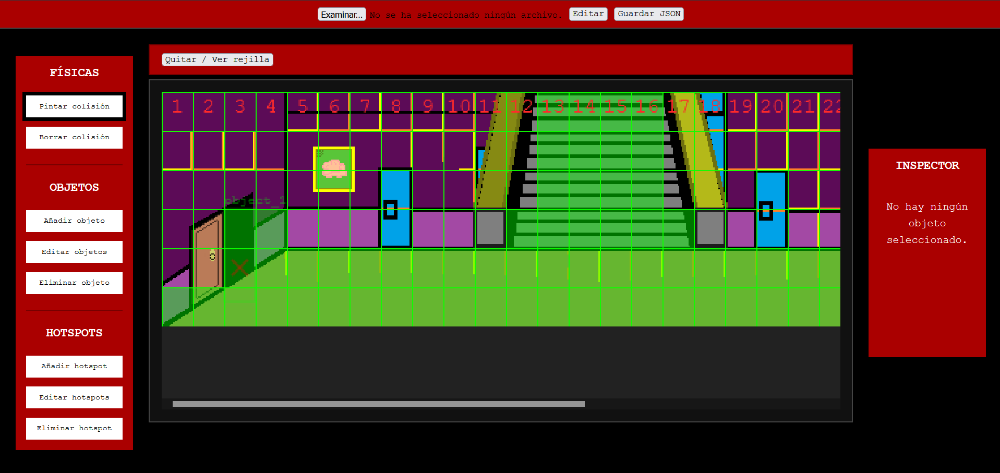
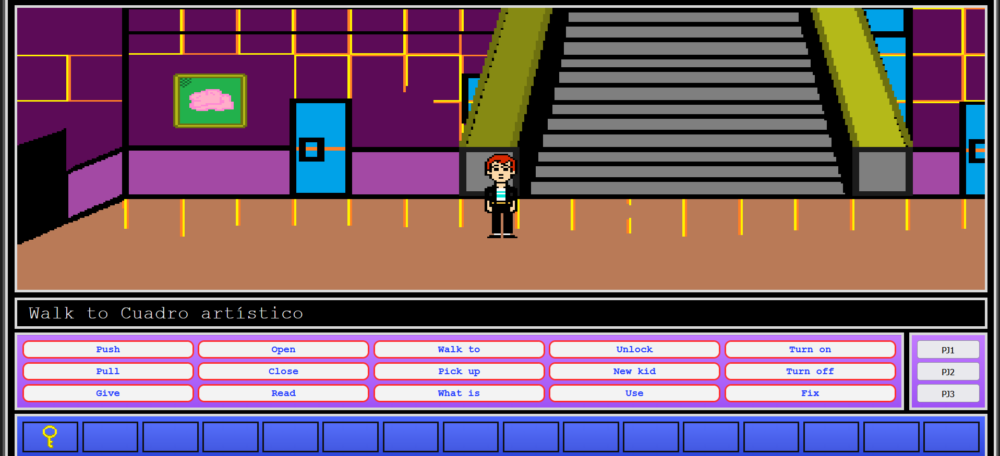

# 🎮 Adventure Engine JS

> Motor gráfico 2D para aventuras gráficas estilo Monkey Island desarrollado desde cero con JavaScript y HTML5 Canvas.

---

## 📖 Descripción

Adventure Engine JS es un proyecto que combina un **motor gráfico 2D** y un **videojuego**, desarrollados íntegramente desde cero con JavaScript y HTML5 Canvas.

El objetivo principal del proyecto es construir un motor gráfico para aventuras gráficas clásicas, permitiendo crear y editar el contenido del juego mediante un **editor visual**, evitando tener que modificar el código fuente para diseñar mapas o escenas.

El editor, inspirado en herramientas como **RPG Maker**, permite actualmente:

- Crear y editar mapas.
- Pintar zonas de colisión.
- Colocar objetos interactivos.
- Crear y editar hotspots.
- Configurar puertas y teletransportes.
- Definir puntos de interacción visualmente.
- Guardar y cargar mapas mediante archivos JSON.

Además del editor, la aplicación incorpora el propio motor del juego. Al iniciar la aplicación se muestra una pantalla de **"Press Start"**.

- Si el usuario pulsa cualquier tecla, comienza la partida.
- Si pulsa la tecla **1**, accede directamente al modo editor para modificar el contenido del juego.

La arquitectura del proyecto está separada en distintos módulos para facilitar su mantenimiento y escalabilidad. Actualmente destacan dos componentes principales:

- **editor.js** → Gestiona toda la lógica del editor visual.
- **game.js** → Contiene el motor del juego, incluyendo movimiento, físicas, interacción, inventario, pathfinding A* y la lógica general del gameplay.

El objetivo a largo plazo es continuar ampliando tanto el motor como el propio videojuego, incorporando nuevas funcionalidades como NPCs, diálogos, scripts, cinemáticas y sistemas avanzados de interacción.

---

## ✨ Características

- Editor de mapas
- Editor de colisiones
- Sistema de objetos
- Sistema de hotspots
- Inventario
- Verbos clásicos
- Pathfinding A*
- Teletransportes
- Inspector visual
- JSON

---

## 📷 Capturas


<h3>Editor</h3>

<p align="center">
  
</p>

<h3>Juego</h3>

<p align="center">
  
</p>

---

## 🏗 Arquitectura

# Motor 

El proyecto está organizado siguiendo una arquitectura modular, donde cada parte del motor tiene una responsabilidad concreta. Aunque actualmente se encuentra en su **primera versión estable (v1.0)**, la base ya está preparada para seguir creciendo y será refactorizada en futuras versiones para separar aún más las responsabilidades entre módulos.

## Inicio de la aplicación

El punto de entrada del proyecto es el archivo **index.html**, que carga todos los módulos necesarios para iniciar tanto el motor del juego como el editor.

```html
<script src="js/config.js"></script>

<script src="js/catalogs/objects.js"></script>
<script src="js/catalogs/hotspots.js"></script>
<script src="js/catalogs/maps.js"></script>

<script src="js/editor.js"></script>

<script src="./js/game/game_state.js"></script>
<script src="js/game.js"></script>
<script src="js/app.js"></script>
```

Cada uno de estos módulos tiene una responsabilidad concreta dentro del motor.

---

## Flujo de inicio

Cuando la aplicación arranca se muestra una pantalla de **"Press Start"**.

A partir de este punto existen dos modos de funcionamiento:

- **Cualquier tecla** → Inicia el videojuego.
- **Tecla 1** → Abre directamente el editor de mapas.

Una vez comienza la partida, el motor carga automáticamente el **Mapa 1**, que actúa como escena inicial del juego.

---

## Sistema basado en datos (Data Driven)

Uno de los objetivos principales del motor es que el contenido del juego no dependa del código.

Cada mapa dispone de su propio archivo JSON donde únicamente se almacena la información de esa escena.

Por ejemplo:

```
map1.json
```

Este archivo contiene información como:

- Mapa utilizado.
- Objetos colocados.
- Hotspots.
- Colisiones.
- Posición de los elementos.
- Configuración propia de la escena.

El motor simplemente lee este archivo y construye el nivel automáticamente.

---

## Catálogos globales

Los objetos no almacenan toda su lógica dentro del mapa.

En su lugar, el motor utiliza **catálogos globales**, que funcionan como plantillas reutilizables.

Actualmente existen catálogos para:

- Objetos
- Hotspots
- Mapas

Por ejemplo, una puerta se define una única vez dentro del catálogo de objetos indicando propiedades como:

- Tipo de objeto.
- Sprite.
- Tamaño.
- Hitbox.
- Estados (abierta / cerrada).
- Si requiere una llave.
- Información del teletransporte.
- Comportamiento durante la interacción.

Cuando un mapa necesita una puerta, simplemente hace referencia a esa plantilla.

Esto evita duplicar información y facilita enormemente el mantenimiento del proyecto.

---

## Motor del juego

Toda la lógica del gameplay se encuentra actualmente centralizada principalmente en **game.js**.

Entre otras responsabilidades, este módulo controla:

- Movimiento del jugador.
- Sistema de verbos clásicos.
- Inventario.
- Interacción con objetos.
- Hotspots.
- Puertas.
- Sistema de teletransporte.
- Pathfinding A*.
- Carga de mapas.
- Estados generales del juego.

Actualmente el motor ya es completamente funcional y permite crear aventuras gráficas jugables.

---

## Editor visual

El editor dispone de un módulo independiente (**editor.js**) encargado de modificar el contenido del juego sin necesidad de editar código.

Actualmente permite:

- Pintar colisiones.
- Colocar objetos.
- Editar objetos.
- Eliminar objetos.
- Crear hotspots.
- Editar hotspots.
- Definir puntos de interacción.
- Guardar y cargar mapas mediante JSON.

Gracias a este sistema, el contenido del juego puede diseñarse de forma completamente visual.

---

## Escalabilidad

La arquitectura ha sido diseñada pensando en futuras ampliaciones.

La idea es continuar incorporando nuevos catálogos especializados como:

- NPCs
- Eventos
- Música
- Sonidos
- Cinemáticas
- Scripts
- Misiones

El objetivo es que el motor simplemente consulte el mapa y los distintos catálogos para construir automáticamente cada escena del juego.

---

## Estado actual del proyecto

La versión **1.0** representa la primera versión estable del motor.

Aunque la arquitectura ya permite desarrollar aventuras gráficas completas, en futuras versiones se realizará una importante refactorización interna para dividir mejor las responsabilidades entre módulos, mejorar el rendimiento y facilitar el mantenimiento del código conforme el proyecto siga creciendo.

---

## 🛠 Editor

## Editor visual

El editor dispone de un módulo independiente (**editor.js**) encargado de modificar el contenido del juego sin necesidad de editar código.

Actualmente permite:

- Pintar colisiones.
- Colocar objetos.
- Editar objetos.
- Eliminar objetos.
- Crear hotspots.
- Editar hotspots.
- Definir puntos de interacción.
- Guardar y cargar mapas mediante JSON.

Gracias a este sistema, el contenido del juego puede diseñarse de forma completamente visual. 

---

## Escalabilidad

La arquitectura ha sido diseñada pensando en futuras ampliaciones.

La idea es continuar incorporando nuevos catálogos especializados como:

- NPCs
- Eventos
- Música
- Sonidos
- Cinemáticas
- Scripts
- Misiones

El objetivo es que el motor simplemente consulte el mapa y los distintos catálogos para construir automáticamente cada escena del juego.

---

## Estado actual del proyecto

La versión **1.0** representa la primera versión estable del motor.

Aunque la arquitectura ya permite desarrollar aventuras gráficas completas, en futuras versiones se realizará una importante refactorización interna para dividir mejor las responsabilidades entre módulos, mejorar el rendimiento y facilitar el mantenimiento del código conforme el proyecto siga creciendo.

---

## 🚀 Roadmap

- [x] Editor
- [x] Pathfinding A*
- [x] Hotspots
- [x] Objetos
- [ ] NPC
- [ ] Diálogos
- [ ] Scripts
- [ ] Sonido
- [ ] Guardado de partida

---

## 🧩 Cómo añadir nuevos mapas, objetos y hotspots

El motor utiliza una arquitectura basada en catálogos y archivos JSON. Para añadir nuevo contenido, primero se define en los catálogos y después se coloca visualmente desde el editor.

### Añadir un nuevo mapa

Para crear un nuevo mapa, por ejemplo `map3`, sigue estos pasos:

1. Añade la definición del nuevo mapa en:

```text
js/catalogs/maps.js
```

Utiliza como referencia las plantillas existentes de `map1` y `map2`.

2. Diseña la imagen del nuevo mapa:

```text
map3.png
```

3. Guarda la imagen dentro de:

```text
img/maps/
```

4. Crea una puerta o elemento de acceso desde otro mapa, por ejemplo desde `map2`.

5. Añade ese nuevo objeto en:

```text
js/catalogs/objects.js
```

La puerta deberá incluir:

- El mapa de destino.
- Las coordenadas de aparición.
- La dirección inicial del personaje.
- El sprite correspondiente.
- El estado inicial de la puerta.
- Cualquier requisito necesario, como una llave.

Ejemplo:

```js
{
  id: "door_to_map3",
  type: "door",

  name: "Puerta hacia el mapa 3",

  sprite: "door_map3.png",

  teleportTo: "map3",
  teleportX: 5,
  teleportY: 4,
  teleportDirection: "right"
}
```

6. Añade el sprite de la puerta en:

```text
img/objects/
```

7. Abre el editor y carga el mapa desde el que se accederá al nuevo mapa.

8. Coloca la puerta en la posición deseada.

9. Pinta como caminable la zona necesaria para que el personaje pueda llegar hasta ella.

10. Utiliza la herramienta **Definir punto de interacción** para marcar con la X roja la casilla exacta que debe alcanzar el personaje antes de activar la puerta.

11. Guarda el mapa en formato JSON y sustituye el archivo correspondiente dentro de:

```text
data/maps/
```

---

### Añadir un nuevo objeto

1. Añade una nueva entrada en:

```text
js/catalogs/objects.js
```

2. Define sus propiedades:

- `id`
- `type`
- `name`
- `sprite`
- tamaño
- hitbox
- si puede recogerse
- estados especiales
- requisitos de uso

3. Añade el sprite en:

```text
img/objects/
```

4. Abre el editor.

5. Selecciona **Añadir objeto**.

6. Cambia el objeto desde el inspector.

7. Colócalo en la escena y guarda el JSON.

---

### Añadir un nuevo hotspot

1. Añade una nueva entrada en:

```text
js/catalogs/hotspots.js
```

2. Define su identificador, nombre y descripción.

3. Abre el editor.

4. Selecciona **Añadir hotspot**.

5. Dibuja la zona interactiva sobre el mapa.

6. Asocia el hotspot correcto desde el inspector.

7. Guarda el mapa en formato JSON.

---

## Flujo general

```text
Catálogo
   ↓
Editor
   ↓
map.json
   ↓
Motor del juego
```

Los catálogos definen qué elementos existen.

El editor define dónde se colocan y cómo se configuran dentro de cada mapa.

El archivo JSON guarda el resultado final.

El motor carga esos datos y construye automáticamente la escena.

---

## 💻 Tecnologías

- HTML5
- CSS3
- JavaScript
- Canvas API

---

## ▶ Cómo ejecutar el proyecto

Este proyecto está desarrollado como una aplicación web basada en **HTML5, CSS y JavaScript**, por lo que no requiere ningún proceso de compilación.

Para ejecutarlo de forma local:

1. Clona el repositorio.

```bash
git clone https://github.com/megalol-dev/Motor_grafico.git
```

2. Abre la carpeta del proyecto con **Visual Studio Code**.

3. Instala la extensión **Live Server** (si todavía no la tienes).

4. Haz clic derecho sobre el archivo:

```text
index.html
```

5. Selecciona:

```text
Open with Live Server
```

El navegador abrirá automáticamente la aplicación y ya podrás acceder tanto al motor del juego como al editor integrado.

> **Nota:** El proyecto utiliza carga de archivos JSON mediante `fetch()`, por lo que no funcionará correctamente abriendo directamente el archivo `index.html` desde el explorador de archivos. Es necesario ejecutarlo mediante un servidor local como Live Server.

---

## 📄 Licencia

Este proyecto ha sido desarrollado con fines **educativos, de investigación y como parte de un porfolio personal**.

El código fuente puede utilizarse como referencia para aprendizaje y consulta, respetando siempre la autoría del proyecto.

No está permitido utilizar este proyecto, ni partes sustanciales de su código, para fines comerciales o lucrativos sin autorización expresa del autor.

### Recursos gráficos

La versión actual del proyecto utiliza algunos recursos gráficos inspirados o procedentes de videojuegos clásicos (por ejemplo, personajes de la versión de **NES** de *Maniac Mansion*) con el único propósito de realizar una demostración técnica del motor gráfico.

Todos los derechos sobre dichos recursos pertenecen a sus respectivos propietarios.

Cualquier uso comercial, redistribución o explotación de esos recursos por parte de terceros será responsabilidad exclusiva de quien los utilice.

En futuras versiones del proyecto estos recursos podrán ser sustituidos por contenido original para disponer de una identidad visual completamente propia.
