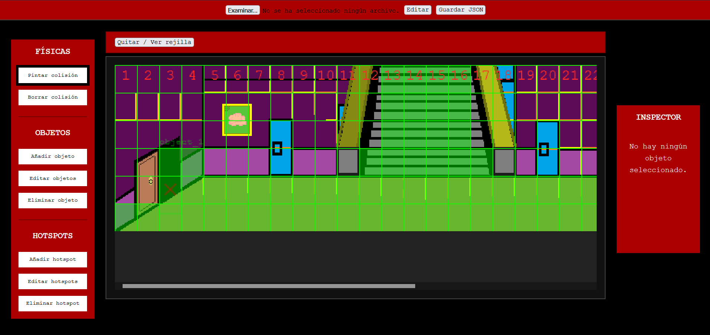
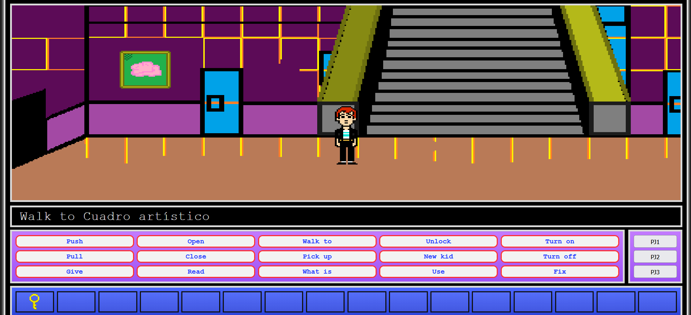
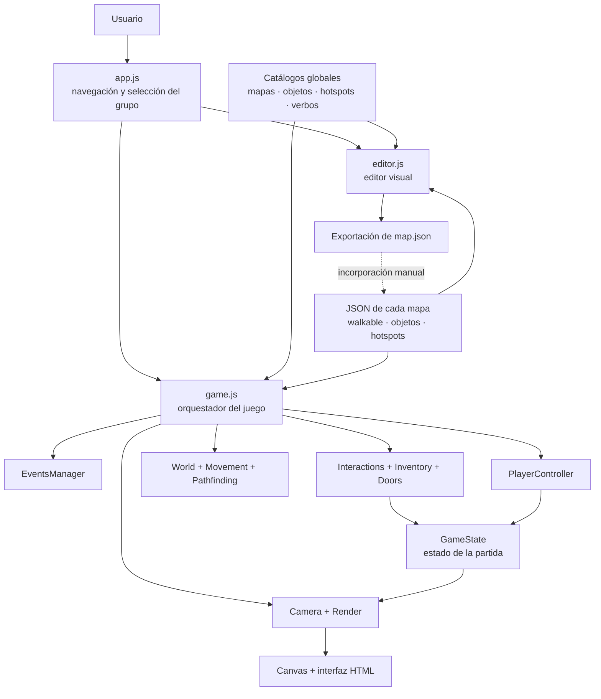
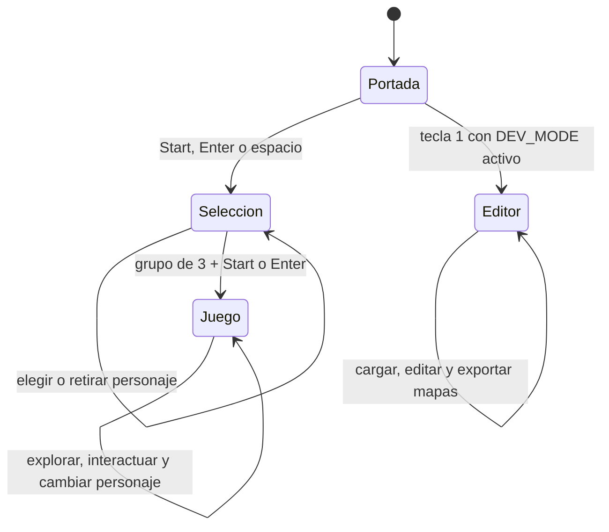
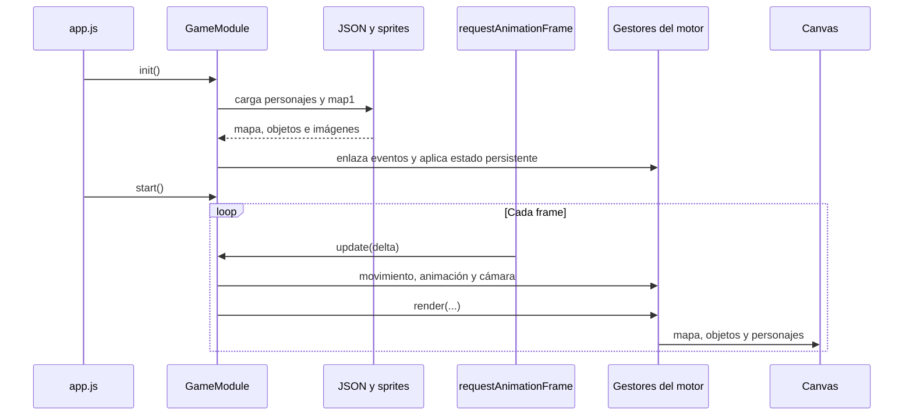
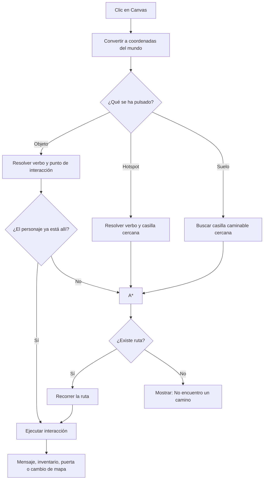
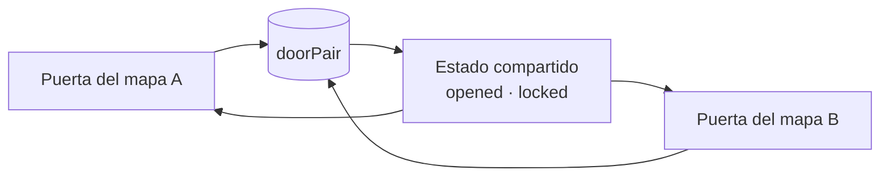
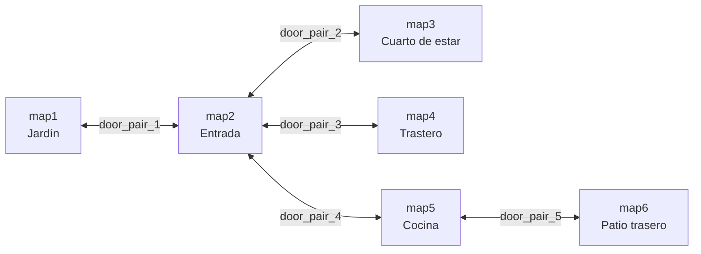

# Adventure Engine JS

> Motor gráfico 2D para crear aventuras gráficas point-and-click de estilo clásico, desarrollado desde cero con JavaScript y HTML5 Canvas e integrado con un editor visual de mapas.


Adventure Engine JS combina un motor de juego y un editor visual en una única aplicación web. El proyecto permite construir escenas mediante imágenes y archivos JSON, definir zonas caminables, colocar objetos y hotspots, conectar mapas mediante puertas y jugar la aventura con una interfaz de verbos inspirada en clásicos como *Maniac Mansion* y *Monkey Island*.

El motor no utiliza frameworks ni librerías externas. La representación gráfica se realiza con Canvas, la interfaz se construye con HTML y CSS, y toda la lógica se organiza en módulos JavaScript especializados. Los catálogos describen qué elementos existen; el editor decide dónde se colocan; los JSON almacenan cada escena; y el motor interpreta esos datos durante la partida.

## Índice

- [Vista del proyecto](#vista-del-proyecto)
- [Funcionalidades](#funcionalidades)
- [Arquitectura](#arquitectura)
- [Flujo de la aplicación](#flujo-de-la-aplicación)
- [Motor del juego](#motor-del-juego)
- [Sistema de interacción](#sistema-de-interacción)
- [Movimiento y pathfinding](#movimiento-y-pathfinding)
- [Estado, puertas e inventario](#estado-puertas-e-inventario)
- [Editor visual](#editor-visual)
- [Sistema basado en datos](#sistema-basado-en-datos)
- [Mapas disponibles](#mapas-disponibles)
- [Estructura del repositorio](#estructura-del-repositorio)
- [Tecnologías](#tecnologías)
- [Ejecución local](#ejecución-local)
- [Estado actual y evolución prevista](#estado-actual-y-evolución-prevista)
- [Qué demuestra este proyecto](#qué-demuestra-este-proyecto)
- [Autor y contacto](#-autor-y-contacto)
- [Licencia](#-licencia)

## Vista del proyecto

### Editor visual

El editor permite construir el contenido jugable sobre la imagen de cada escenario, mostrando la cuadrícula, las zonas caminables, los objetos, sus hitboxes, los hotspots y las áreas de portal.



### Juego

La pantalla de juego combina el escenario renderizado en Canvas con una interfaz clásica de acciones, cambio de personaje e inventario.



## Funcionalidades

### Experiencia de juego

- Pantalla de inicio y selección de un grupo de tres personajes entre seis disponibles.
- Cambio en tiempo real entre los tres integrantes del grupo.
- Posición, mapa e inventario independientes para cada personaje.
- Cámara centrada en el personaje activo y limitada por las dimensiones del escenario.
- Movimiento point-and-click sobre una cuadrícula navegable.
- Cálculo de rutas A* en cuatro direcciones.
- Animación por sprites según movimiento y dirección.
- Nueve verbos de aventura gráfica: `Usar`, `Abrir`, `Cerrar`, `Ver`, `Leer`, `Recoger`, `Encender`, `Apagar` y `Combinar`.
- Acción interna `Walk to` como comportamiento predeterminado.
- Detección de objetos y hotspots mediante áreas interactivas.
- Inventario visual de 16 espacios para el personaje activo.
- Selección de objetos del inventario para utilizarlos sobre elementos del escenario mediante `Usar`.
- Puertas enlazadas entre mapas, desbloqueo mediante objetos y teletransporte.
- Persistencia en memoria de objetos recogidos y puertas modificadas durante la partida.

### Herramientas del editor

- Carga de imágenes PNG como base de un mapa.
- Carga de los seis mapas registrados en el catálogo.
- Pintado y borrado de casillas caminables.
- Cuadrícula lógica de `24 × 30` píxeles.
- Creación, selección, desplazamiento y eliminación de objetos.
- Asignación de objetos a partir del catálogo global.
- Visualización de sprites e hitboxes.
- Creación, selección, desplazamiento y eliminación de hotspots.
- Asignación de tipos de hotspot desde el inspector.
- Definición visual de áreas de portal para puertas.
- Exportación del mapa completo a JSON.

## Arquitectura

La aplicación sigue una arquitectura modular y basada en datos. `app.js` administra las pantallas generales; `game.js` coordina la ejecución del juego; los módulos de `js/game/` encapsulan responsabilidades concretas; y `editor.js` mantiene su propio flujo de edición.


```mermaid
flowchart TB
    U[Usuario] --> APP[app.js<br/>navegación y selección del grupo]
    APP --> GAME[game.js<br/>orquestador del juego]
    APP --> EDITOR[editor.js<br/>editor visual]

    CATALOGS[Catálogos globales<br/>mapas · objetos · hotspots · verbos] --> GAME
    CATALOGS --> EDITOR
    JSON[JSON de cada mapa<br/>walkable · objetos · hotspots] --> GAME
    JSON --> EDITOR

    GAME --> EVENTS[EventsManager]
    GAME --> PLAYER[PlayerController]
    GAME --> WORLD[World + Movement + Pathfinding]
    GAME --> ACTIONS[Interactions + Inventory + Doors]
    GAME --> VIEW[Camera + Render]

    ACTIONS --> STATE[GameState<br/>estado de la partida]
    PLAYER --> STATE
    STATE --> VIEW
    VIEW --> CANVAS[Canvas + interfaz HTML]

    EDITOR --> EXPORT[Exportación de map.json]
    EXPORT -. incorporación manual .-> JSON
```

| Capa | Archivos principales | Responsabilidad |
|---|---|---|
| Aplicación | `js/app.js`, `js/config.js` | Cambia entre portada, selección, juego y editor; guarda el grupo elegido y controla el modo de desarrollo. |
| Orquestación | `js/game.js` | Inicializa recursos, conserva el estado de ejecución, carga mapas y sprites, coordina el bucle principal y conecta los gestores. |
| Entrada e interacción | `events.js`, `interactions.js` | Interpreta clics, hover, verbos, objetos, hotspots y acciones pendientes. |
| Navegación | `world.js`, `movement.js`, `pathfinding.js`, `player_controller.js` | Valida posiciones, calcula rutas, desplaza al personaje y ejecuta acciones al alcanzar el destino. |
| Estado de juego | `game_state.js`, `doors.js`, `inventory.js` | Conserva cambios de objetos, sincroniza puertas enlazadas y administra inventarios. |
| Presentación | `camera.js`, `render.js`, `css/` | Calcula el encuadre y dibuja mapas, objetos y personajes; presenta la interfaz del juego y del editor. |
| Contenido | `js/catalogs/`, `data/maps/`, `img/` | Define recursos reutilizables y almacena la configuración concreta de cada escena. |
| Edición | `js/editor.js` | Permite modificar visualmente colisiones, objetos, hotspots y portales, y exportar el resultado. |

### Principios de diseño

| Principio | Aplicación en el proyecto |
|---|---|
| Separación de responsabilidades | El orquestador delega cámara, renderizado, movimiento, rutas, interacciones, inventario y puertas en módulos independientes. |
| Contenido separado de la lógica | Los mapas y sus instancias se almacenan en JSON; las definiciones reutilizables viven en catálogos. |
| Estado no destructivo | Los JSON actúan como plantilla y `GameState` guarda los cambios de la sesión sin modificar los archivos originales. |
| Reutilización | Una definición de objeto o puerta puede utilizarse desde el editor y desde el juego. |
| Compatibilidad progresiva | El editor completa datos ausentes desde los catálogos y contempla mapas antiguos sin `typeId`. |
| Escalabilidad modular | Los gestores se exponen mediante `window` y reciben por parámetros el contexto que necesitan. |

## Flujo de la aplicación


```mermaid
stateDiagram-v2
    [*] --> Portada
    Portada --> Seleccion: Start, Enter o espacio
    Portada --> Editor: tecla 1 con DEV_MODE activo
    Seleccion --> Seleccion: elegir o retirar personaje
    Seleccion --> Juego: grupo de 3 + Start o Enter
    Juego --> Juego: explorar, interactuar y cambiar personaje
    Editor --> Editor: cargar, editar y exportar mapas
```

`CONFIG.DEV_MODE` controla el acceso directo al editor desde la portada. Cuando está activo, la tecla `1` abre las herramientas de creación; cuando está desactivado, el jugador solo puede seguir el flujo normal hacia la selección de personajes.

La selección se guarda en `localStorage` y el motor asigna los sprites elegidos a `slot1`, `slot2` y `slot3`. Después, cada integrante mantiene su propio mapa, posición, dirección e inventario.

## Motor del juego

### Orquestador y ciclo de actualización

`GameModule`, definido en `js/game.js`, es el punto central del runtime. Su función no es implementar todos los sistemas, sino inicializarlos y proporcionarles el contexto necesario.


```mermaid
sequenceDiagram
    participant App as app.js
    participant Game as GameModule
    participant Data as JSON y sprites
    participant RAF as requestAnimationFrame
    participant Managers as Gestores del motor
    participant Canvas

    App->>Game: init()
    Game->>Data: carga personajes y map1
    Data-->>Game: mapa, objetos e imágenes
    Game->>Managers: enlaza eventos y aplica estado persistente
    App->>Game: start()
    loop Cada frame
        RAF->>Game: update(delta)
        Game->>Managers: movimiento, animación y cámara
        Game->>Managers: render(...)
        Managers->>Canvas: mapa, objetos y personajes
    end
```

| Elemento | Implementación actual |
|---|---|
| Renderizado | Canvas interno de `1248 × 540`, escalado visualmente mediante CSS. |
| Escala | Mapa y personajes se dibujan con escala `3`. |
| Sprites | Se cargan seis hojas de personaje y los sprites utilizados por el mapa actual. |
| Animación | Cuatro frames de movimiento y frames de reposo para las direcciones arriba, abajo, izquierda y derecha. |
| Actualización | `requestAnimationFrame` calcula `delta`, actualiza el jugador activo y vuelve a renderizar. |
| Cambio de mapa | Carga el nuevo JSON y su imagen, restaura estados, coloca al personaje activo y recentra la cámara. |

### Renderizado y cámara

`RenderManager` dibuja, en este orden:

1. La región visible de la imagen del mapa.
2. Los objetos visibles y no recogidos.
3. Los compañeros presentes en el mismo mapa.
4. El personaje activo.

Las puertas abiertas siguen existiendo en los datos, pero su sprite deja de dibujarse y también dejan de bloquear el movimiento. `CameraManager` sigue al personaje activo y limita el desplazamiento para no mostrar espacio exterior al mundo.

## Sistema de interacción

Los verbos visibles se generan dinámicamente desde `VerbLibrary`. Los clics del usuario se convierten desde coordenadas de pantalla a coordenadas del mundo y se comprueba, por orden, si existe un objeto, un hotspot o suelo bajo el cursor.


```mermaid
flowchart TD
    CLICK[Clic en Canvas] --> POINT[Convertir a coordenadas del mundo]
    POINT --> HIT{¿Qué se ha pulsado?}
    HIT -->|Objeto| OBJ[Resolver verbo y punto de interacción]
    HIT -->|Hotspot| HOT[Resolver verbo y casilla cercana]
    HIT -->|Suelo| GROUND[Buscar casilla caminable cercana]
    OBJ --> NOW{¿El personaje ya está allí?}
    HOT --> PATH[A*]
    GROUND --> PATH
    NOW -->|Sí| ACTION[Ejecutar interacción]
    NOW -->|No| PATH
    PATH --> FOUND{¿Existe ruta?}
    FOUND -->|Sí| MOVE[Recorrer la ruta]
    FOUND -->|No| ERROR[Mostrar: No encuentro un camino]
    MOVE --> ACTION
    ACTION --> RESULT[Mensaje, inventario, puerta o cambio de mapa]
```

| Acción | Comportamiento implementado |
|---|---|
| `Walk to` | Camina hasta el suelo, objeto o puerta; atraviesa una puerta que ya esté abierta. |
| `Ver` | Muestra directamente la descripción del objeto o hotspot sin obligar al personaje a caminar. |
| `Recoger` | Se aproxima al objeto, comprueba que sea recogible, lo oculta del mapa y lo añade al inventario activo. |
| `Usar` | Permite seleccionar un objeto del inventario y utilizarlo sobre un elemento del escenario. |
| `Abrir` | Abre puertas normales; si una puerta requiere un objeto, informa de que está cerrada con llave. |
| Otros verbos | Están disponibles en la interfaz y preparados para ampliar sus comportamientos específicos. |

Los mensajes se muestran en la línea de acciones. Tras completar acciones como `Ver`, `Recoger` o abrir una puerta, el sistema vuelve al comportamiento predeterminado de desplazamiento.

## Movimiento y pathfinding

Cada mapa contiene una matriz `walkable`. El valor `1` identifica una casilla transitable y `0` una zona bloqueada. Las puertas cerradas añaden obstáculos dinámicos sin modificar esa matriz.

El módulo `PathfindingManager` implementa A* con estas características:

- Heurística Manhattan.
- Movimiento ortogonal en cuatro direcciones.
- Sin diagonales, para evitar atravesar esquinas.
- Búsqueda de la casilla caminable más cercana cuando el destino exacto no es válido.
- Puntos de interacción explícitos para objetos y puertas.
- Búsqueda automática de una posición cercana para hotspots.

`PlayerController` recorre los nodos devueltos por A*, actualiza la dirección visual y ejecuta la interacción pendiente al alcanzar el último nodo. `MovementManager` se encarga de validar cada posición y de actualizar la animación.

## Estado, puertas e inventario

### Estado de la partida

Los archivos JSON nunca se alteran durante el juego. `GameState` mantiene dos almacenes en memoria:

| Almacén | Contenido |
|---|---|
| `GameState.maps` | Copias del estado modificado de objetos concretos en cada mapa. |
| `GameState.doors` | Estado compartido `opened` y `locked` de cada pareja de puertas. |

Este diseño permite recoger un objeto, cambiar de escena y conservar su desaparición al regresar. También mantiene sincronizadas las dos caras de una puerta durante toda la sesión.

### Puertas enlazadas

Cada acceso utiliza un identificador `doorPair` común en sus dos extremos:


```mermaid
flowchart LR
    A[Puerta del mapa A] --> PAIR[(doorPair)]
    B[Puerta del mapa B] --> PAIR
    PAIR --> STATE[Estado compartido<br/>opened · locked]
    STATE --> A
    STATE --> B
```

Una puerta puede declarar el mapa de destino, la casilla de aparición, la dirección inicial, un objeto requerido y una casilla exacta de interacción. Al desbloquear una de sus caras, `DoorManager` actualiza el estado compartido y lo aplica a las instancias cargadas.

### Inventario por personaje

El estado contiene un inventario independiente para cada uno de los tres slots. Al cambiar de personaje, `InventoryManager` limpia la cuadrícula visual y representa únicamente sus objetos. Un elemento seleccionado para `Usar` se resalta y se incorpora al texto contextual al pasar el cursor sobre un objetivo.

Actualmente el inventario vive en memoria: no existe todavía un sistema de guardado y carga de partidas entre sesiones del navegador.

## Editor visual

`EditorModule` funciona como una herramienta integrada dentro de la misma aplicación. Utiliza un Canvas con coordenadas lógicas del mapa y lo muestra ampliado al doble para facilitar la edición de pixel art.

| Modo | Operación |
|---|---|
| Pintar colisión | Marca una casilla como caminable en la matriz `walkable`. |
| Borrar colisión | Devuelve la casilla al estado no caminable. |
| Añadir objeto | Crea una instancia basada inicialmente en el objeto `key` del catálogo. |
| Editar objetos | Permite seleccionar, arrastrar y cambiar el tipo de una instancia. |
| Eliminar objeto | Borra la instancia seleccionada del mapa en edición. |
| Añadir hotspot | Dibuja una zona rectangular y la asocia al primer tipo disponible. |
| Editar hotspots | Permite mover la zona y cambiar su entrada de catálogo. |
| Eliminar hotspot | Retira la zona interactiva del mapa. |
| Definir zona portal | Dibuja un rectángulo asociado a una puerta. |
| Guardar JSON | Serializa imagen, cuadrícula, dimensiones, objetos y hotspots. |

### Flujo de creación de contenido


```mermaid
flowchart LR
    ASSET[Crear imagen PNG] --> CATALOG[Registrar mapa y recursos]
    CATALOG --> LOAD[Cargar mapa en el editor]
    LOAD --> WALK[Pintar zonas caminables]
    WALK --> PLACE[Colocar objetos y hotspots]
    PLACE --> PORTAL[Configurar puertas y portales]
    PORTAL --> SAVE[Exportar JSON]
    SAVE --> DATA[Incorporar a data/maps]
    DATA --> PLAY[El motor construye la escena]
```

El editor genera una descarga JSON en el navegador. Para que el motor utilice la nueva versión, el archivo exportado debe colocarse manualmente en `data/maps/` con el nombre registrado en `MapLibrary`.

## Sistema basado en datos

La lógica compartida no se duplica en cada escena. El proyecto diferencia entre definición e instancia:

| Tipo de dato | Ubicación | Función |
|---|---|---|
| Catálogo de mapas | `js/catalogs/maps.js` | Relaciona identificador, nombre, imagen PNG y archivo JSON. |
| Catálogo de objetos | `js/catalogs/objects.js` | Define objetos y puertas: nombre, descripción, sprite, dimensiones, recogida, estado y teletransporte. |
| Catálogo de hotspots | `js/catalogs/hotspots.js` | Define nombres y descripciones de zonas sin sprite. |
| Catálogo de verbos | `js/catalogs/verbs.js` | Define identificadores internos y etiquetas visibles de las acciones. |
| Instancias de mapa | `data/maps/mapN.json` | Guarda posiciones, hitboxes, cuadrícula, objetos y hotspots de una escena. |
| Recursos gráficos | `img/maps/`, `img/objects/`, `img/personajes/` | Contiene fondos, elementos interactivos y hojas de sprites. |

Una instancia de objeto utiliza `typeId` para vincularse con `ObjectLibrary`. El editor completa y sincroniza sus propiedades desde esa definición antes de guardar, mientras que el motor utiliza la instancia resultante para construir la escena.

### Datos principales de un mapa

| Campo | Descripción |
|---|---|
| `image` | Imagen de fondo de la escena. |
| `tileWidth`, `tileHeight` | Tamaño lógico de cada casilla. |
| `cols`, `rows` | Dimensiones de la cuadrícula. |
| `walkable` | Matriz binaria utilizada por movimiento y A*. |
| `objects` | Instancias visibles o interactivas colocadas en el mapa. |
| `hotspots` | Rectángulos interactivos sin sprite propio. |

### Datos principales de una puerta

| Campo | Descripción |
|---|---|
| `doorPair` | Identificador que sincroniza las dos caras del acceso. |
| `opened`, `locked` | Estado inicial de la puerta. |
| `requiredItem` | `typeId` del objeto necesario para desbloquearla. |
| `teleportTo` | Identificador del mapa de destino. |
| `teleportX`, `teleportY` | Casilla donde aparecerá el personaje. |
| `teleportDirection` | Orientación del personaje tras cambiar de mapa. |
| `interactionTileX`, `interactionTileY` | Casilla exacta desde la que se ejecuta la acción. |
| `interactionMode`, `teleportMode` | Configuración del modo de acceso para puertas especiales. |
| `portal` | Rectángulo visual definido desde el editor. |

## Mapas disponibles

El prototipo contiene seis escenas y cinco parejas de puertas:

| Mapa | Nombre | Cuadrícula | Contenido interactivo |
|---|---|---:|---|
| `map1` | Jardín | `32 × 6` | Llave y puerta principal hacia `map2`. |
| `map2` | Entrada | `32 × 6` | Puertas hacia `map1`, `map3`, `map4` y `map5`; hotspot de un cuadro. |
| `map3` | Cuarto de estar | `26 × 6` | Puerta de regreso a `map2`. |
| `map4` | Trastero | `18 × 6` | Puerta de regreso a `map2`. |
| `map5` | Cocina | `32 × 6` | Puertas hacia `map2` y `map6`. |
| `map6` | Patio trasero | `32 × 6` | Puerta de regreso a `map5`. |


```mermaid
flowchart LR
    M1[map1<br/>Jardín] <-->|door_pair_1| M2[map2<br/>Entrada]
    M2 <-->|door_pair_2| M3[map3<br/>Cuarto de estar]
    M2 <-->|door_pair_3| M4[map4<br/>Trastero]
    M2 <-->|door_pair_4| M5[map5<br/>Cocina]
    M5 <-->|door_pair_5| M6[map6<br/>Patio trasero]
```

## Estructura del repositorio

```text
.
├── index.html                   # Estructura de las cuatro pantallas y carga de scripts
├── README.md
├── css/
│   ├── ui.css                   # Portada y selección de personajes
│   ├── game.css                 # Canvas, verbos, personajes e inventario
│   └── editor.css               # Herramientas e inspector del editor
├── data/
│   ├── gameData.json            # Datos conservados de una etapa inicial del prototipo
│   └── maps/
│       ├── map1.json
│       └── ... map6.json
├── img/
│   ├── maps/                    # Fondos de las escenas
│   ├── objects/                 # Sprites de objetos y puertas
│   ├── personajes/              # Sprites y retratos de selección
│   └── imgREADME/               # Capturas de esta documentación
└── js/
    ├── app.js                   # Flujo general de pantallas y selección del grupo
    ├── config.js                # Configuración de desarrollo
    ├── editor.js                # Editor visual
    ├── game.js                  # Orquestador del motor
    ├── catalogs/
    │   ├── hotspots.js
    │   ├── maps.js
    │   ├── objects.js
    │   └── verbs.js
    └── game/
        ├── camera.js
        ├── doors.js
        ├── events.js
        ├── game_state.js
        ├── interactions.js
        ├── inventory.js
        ├── movement.js
        ├── pathfinding.js
        ├── player_controller.js
        ├── render.js
        └── world.js
```

Los scripts se cargan en un orden explícito desde `index.html`: primero la configuración y los catálogos, después el editor y los gestores del juego, y finalmente los orquestadores `game.js` y `app.js`. Este orden permite compartir los módulos mediante el objeto global `window` sin utilizar un empaquetador.

## Tecnologías

| Área | Tecnología | Uso |
|---|---|---|
| Estructura | HTML5 | Define portada, selección, juego, interfaz y editor. |
| Estilos | CSS3 | Diseño retro, distribución responsive, paneles y estados visuales. |
| Lógica | JavaScript ES6 | Motor, editor, entrada, estado y carga asíncrona de recursos. |
| Gráficos | Canvas API | Renderizado de escenarios, objetos, sprites y superposiciones del editor. |
| Datos | JSON | Persistencia de la configuración de cada mapa. |
| Almacenamiento local | Web Storage | Conserva la selección de personajes mediante `localStorage`. |
| Animación | `requestAnimationFrame` | Ejecuta el ciclo de actualización y renderizado. |
| Carga de recursos | Fetch API e `Image` | Obtiene mapas JSON, fondos y sprites desde el servidor local. |

## Ejecución local

### Requisitos

- Un navegador moderno con soporte para Canvas y JavaScript ES6.
- Un servidor HTTP local.
- Opcionalmente, Visual Studio Code con la extensión Live Server.

El proyecto no necesita instalar dependencias ni ejecutar un proceso de compilación.

### Puesta en marcha

1. Clona el repositorio:

```bash
git clone https://github.com/megalol-dev/Motor_grafico.git
```

2. Abre la carpeta del proyecto en Visual Studio Code.
3. Haz clic derecho sobre `index.html`.
4. Selecciona **Open with Live Server**.
5. Utiliza **Start**, `Enter` o la barra espaciadora para acceder a la selección de personajes.
6. Elige exactamente tres personajes y pulsa **Start Game**.

> No se recomienda abrir `index.html` directamente con el protocolo `file://`. Los mapas se cargan mediante `fetch()`, por lo que el navegador necesita servir el proyecto desde HTTP.

### Acceso al editor

Con `DEV_MODE: true` en `js/config.js`, pulsa la tecla `1` mientras estés en la portada. Desde el editor puedes cargar una escena registrada mediante **Editar**, modificarla y descargar su JSON con **Guardar JSON**.

## Estado actual y evolución prevista

El proyecto es un prototipo funcional del motor y de una pequeña aventura de demostración. La base modular y el flujo basado en datos ya están implementados, pero varios verbos y sistemas narrativos todavía están preparados para futuras ampliaciones.

### Implementado

- [x] Editor visual de mapas.
- [x] Matriz de colisiones y zonas caminables.
- [x] Movimiento point-and-click con A*.
- [x] Cámara y renderizado con sprites animados.
- [x] Selección y cambio entre tres personajes.
- [x] Objetos, hotspots y catálogos reutilizables.
- [x] Inventario independiente por personaje.
- [x] Recogida y uso de objetos.
- [x] Puertas enlazadas, desbloqueo y cambio de mapa.
- [x] Persistencia del estado durante la sesión.

### Evolución prevista

- [ ] Completar el comportamiento específico de todos los verbos.
- [ ] Añadir NPC y personajes con comportamiento propio.
- [ ] Incorporar conversaciones y árboles de diálogo.
- [ ] Crear un sistema de scripts y eventos narrativos.
- [ ] Añadir música, efectos de sonido y animaciones de escena.
- [ ] Implementar cinemáticas y transiciones.
- [ ] Incorporar misiones y condiciones de progreso.
- [ ] Guardar y cargar partidas entre sesiones.
- [ ] Ampliar el inspector del editor con propiedades editables, incluida la descripción de los objetos.
- [ ] Continuar reduciendo el acoplamiento a variables globales y evolucionar hacia módulos JavaScript nativos.

## Qué demuestra este proyecto

- Diseño desde cero de un motor especializado en aventuras gráficas 2D.
- Implementación práctica de un algoritmo A* integrado con colisiones dinámicas.
- Separación entre contenido, estado de ejecución y lógica del motor.
- Diseño de herramientas visuales para evitar editar manualmente los datos de cada escena.
- Gestión de múltiples personajes, inventarios y mundos conectados.
- Renderizado de pixel art, animación por sprites y cámara mediante Canvas.
- Refactorización progresiva desde un archivo central hacia gestores con responsabilidades concretas.
- Capacidad para construir una base ampliable sin depender de frameworks externos.

# 📫 Autor y contacto

📧 Email: **escuderopolojoseluis@gmail.com**

🌐 Portfolio: https://megalol-dev.github.io/

💼 LinkedIn: https://linkedin.com/in/jose-luis-escudero-polo

📺 YouTube: https://youtu.be/3K2VQ39qgwA?si=-HmeTHiYCnlPSxOE

---

## 📜 Licencia

Proyecto desarrollado con fines educativos, de investigación y como parte de un portfolio personal.

El código fuente puede utilizarse como referencia para aprendizaje y consulta, respetando siempre la autoría del proyecto. No está permitido utilizar este proyecto, ni partes sustanciales de su código, con fines comerciales o lucrativos sin autorización expresa del autor.

Esta versión utiliza algunos recursos gráficos inspirados o procedentes de videojuegos clásicos —entre ellos sprites de la versión de NES de *Maniac Mansion*— exclusivamente para demostrar técnicamente el funcionamiento del motor. Los derechos de esos recursos pertenecen a sus respectivos propietarios. Cualquier redistribución o explotación de dichos recursos será responsabilidad de quien la realice.
